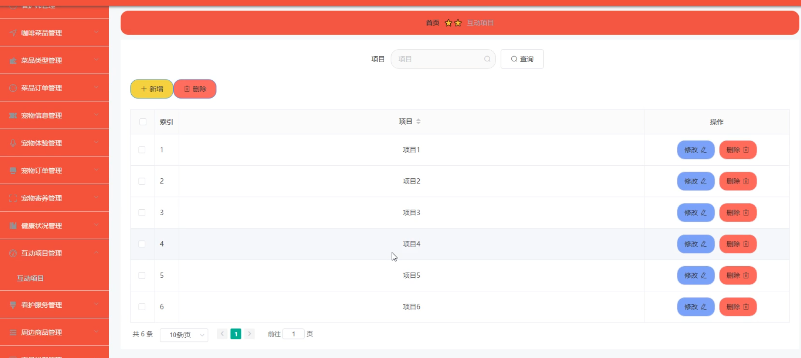

# 基于springboo的t宠物咖啡馆平台

---
### 👉作者QQ ：1556708905 微信：zheng0123Long (支持定制修改、部署调试、定制毕设)

### 👉接网站建设、小程序、H5、APP、各种系统等

---

#### 介绍

基于Spring Boot的宠物咖啡馆平台是一个集宠物照护、咖啡餐饮与周边商品销售于一体的综合性服务平台。该平台通过创新的信息化手段，将传统的咖啡馆体验与宠物养护服务相结合，为宠物爱好者提供了一个温馨、舒适、便捷的交流空间。系统采用先进的Spring Boot框架开发，确保了系统的高性能、高可靠性和可扩展性。同时，系统还引入了微服务架构，使得不同功能模块之间能够独立部署和扩展，提高了系统的灵活性和可维护性。
#### 技术栈

后端技术栈：Springboot+Mysql+Maven

前端技术栈：Vue+Html+Css+Javascript+ElementUI

开发工具：Idea+Vscode+Navicate

#### 系统功能介绍

管理端  
管理端作为整个系统的核心，负责整个平台的资源配置、监控和管理。主要功能模块包括：  

个人中心：管理员可以方便地管理自己的个人信息，包括登录、密码修改等，确保账号的安全和便捷使用。  
用户管理：管理员可以对用户账户进行增删改查操作，包括用户权限的设置和管理，确保平台用户的安全性和规范性。  
看护师管理：管理员可以管理看护师的信息，包括看护师的资质审核、工作安排等，确保看护师的专业性和服务质量。  
咖啡菜品管理：管理员可以管理咖啡馆提供的咖啡和菜品信息，包括添加、编辑和下架菜品，确保菜品的多样性和更新速度。  
菜品类型管理：管理员可以定义和分类咖啡菜品，方便用户查找和选择自己喜欢的菜品。  
菜品订单管理：管理员可以查看和处理用户提交的咖啡菜品订单，确保订单的及时处理和配送。  
宠物信息管理：管理员可以管理咖啡馆内的宠物信息，包括宠物档案、健康状况等，确保宠物的健康和安全。  
宠物体验管理：管理员可以策划和管理宠物互动体验活动，丰富用户的体验内容，提升用户的参与度和满意度。  
宠物订单管理：处理用户提交的宠物服务订单。  
宠物寄养管理：管理宠物的寄养服务，包括寄养规则、费用等。
健康状况管理：跟踪和记录宠物的健康状况。  
互动项目管理：策划和组织与宠物相关的互动活动。  
看护服务管理：制定和发布看护师的服务标准和价格。  
周边商品管理：管理咖啡馆销售的周边商品。  
商品类型管理：定义和分类商品。  
商品购买管理：处理用户的商品购买请求。  
商品入库管理：管理商品的入库和库存。  

看护师端  
看护师端为看护师提供了便捷的工作管理工具，主要功能包括：  

咖啡菜品：查看咖啡馆提供的咖啡和菜品信息，了解最新菜品动态。  
宠物信息：查看咖啡馆内的宠物信息，包括寄养宠物的情况，为看护工作提供参考。  
周边商品：查看咖啡馆销售的周边商品，了解商品种类和价格。  
个人中心：管理自己的个人信息，包括登录、密码修改等。  
后台管理：对宠物体验、寄养、健康状况和看护服务进行管理，确保看护工作的顺利进行。  
用户端  
用户端是宠物爱好者和用户的入口，主要功能包括：  

咖啡菜品：浏览咖啡馆提供的咖啡和菜品信息，选择自己喜欢的菜品进行下单。  
宠物信息：查看咖啡馆内的宠物信息，了解宠物的品种、性格等，为宠物选择提供参考。  
周边商品：浏览和购买咖啡馆的周边商品，丰富自己的宠物生活。  
个人中心：管理自己的个人信息，包括登录、密码修改、订单管理等。  
后台管理：对咖啡菜品、宠物服务、健康状况等进行查询和管理，方便用户随时掌握自己的订单和服务情况。  

#### 系统作用

基于Spring Boot的宠物咖啡馆平台不仅为用户提供了一个集咖啡、宠物与购物于一体的休闲场所，还通过智能化的管理手段提升了用户体验和运营效率。具体来说，系统的作用主要体现在以下几个方面：  

提升用户体验：通过整合咖啡、宠物和购物等多元化服务，为用户提供了一个全方位、一站式的休闲体验。同时，系统还提供了便捷的订单管理和服务查询功能，让用户能够随时掌握自己的订单和服务情况，提升了用户的满意度和忠诚度。  
提高运营效率：系统通过引入先进的信息化手段，实现了对咖啡菜品、宠物信息和周边商品等资源的统一管理和调配。管理员可以方便地查看和处理各种订单和服务请求，提高了工作效率和响应速度。同时，系统还提供了数据统计和分析功能，帮助管理员更好地了解用户需求和市场趋势，为经营决策提供支持。  
加强安全防护：系统采用了严格的安全防护措施，包括用户权限管理、数据加密等，确保用户数据的安全性和隐私保护。同时，系统还提供了多种身份验证和访问控制机制，防止未经授权的访问和操作，保障平台的安全稳定运行。  

#### 系统功能截图

代码结构

数据库表

登录

首页

用户管理

看护师管理

咖啡菜品管理

宠物信息管理

商品入库管理

周边商品

互动项目

看护师端首页页面

用户端宠物订单管理

#### 总结

基于Spring Boot的宠物咖啡馆平台是一个功能丰富、用户体验优良的综合性服务平台。通过管理端、看护师端和用户端的协同工作，平台为用户和看护师提供了高效、便捷的服务。未来，随着技术的不断发展和用户需求的不断变化，我们将继续优化和扩展系统功能，为更多用户提供更加优质的服务体验。

#### 使用说明

创建数据库，执行数据库脚本 修改jdbc数据库连接参数 下载安装maven依赖jar 启动idea中的springboot项目

后台地址：http://localhost:8080/springbootx9rzc/admin/dist/index.html

管理员  abo 密码 abo

前台地址：http://localhost:8080/springbootx9rzc/front/index.html

